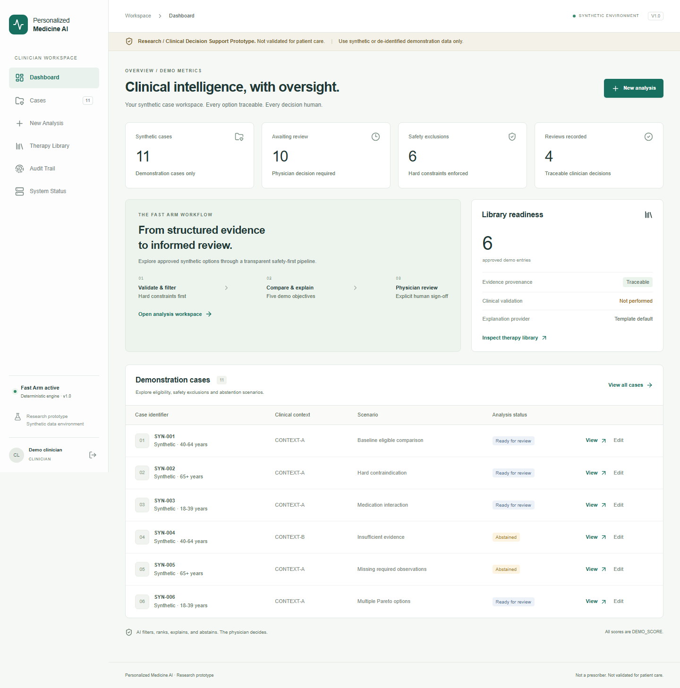
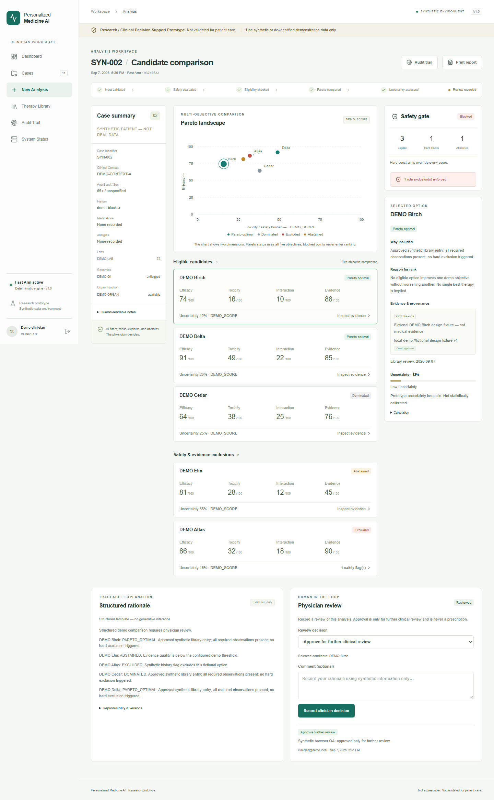

# Personalized Medicine AI · Fast Arm V1

**Research / Clinical Decision Support Prototype. Not validated for patient care.**

**Use synthetic or de-identified demonstration data only.** The delivered fixtures are entirely synthetic. All therapies, rules, genomic markers and evidence references are fictional, and every comparison is labelled **DEMO_SCORE**.

AI filters, ranks, explains, and abstains. **The physician decides.**

## What this is
A clinician-facing, runnable prototype for examining structured synthetic cases against an administrator-controlled demo therapy library. It filters unsafe and unsupported options, compares five objectives with Pareto dominance, explains provenance and uncertainty, and records explicit clinician reviews. Analyses and their original inputs, library contents and versions persist in the database.

This is **not** a medical device, a clinically validated decision system, a prescriber, a diagnostic system or a patient advice service. No real drugs, clinical dose selection, outcome prediction, real genetic associations or real medical evidence are included. The Slow Arm is not implemented. No clinical validation has occurred.

## Architecture

```text
Browser → Next.js (same-origin /api/v1 proxy) → FastAPI
                                              ├── Cookie sessions / role authorization
                                              ├── SQLAlchemy → PostgreSQL / local SQLite
                                              ├── Safety → eligibility → Pareto → uncertainty
                                              ├── Immutable input, library and result snapshots
                                              └── Structured explanation → physician review → audit
```

- Frontend: Next.js 16.3.4, React 19.2.8, TypeScript 5.9.3, Tailwind CSS 4.2.1, Lucide icons.
- Backend: Python 3.11, FastAPI, Pydantic, SQLAlchemy 2, Alembic, Argon2 password hashing.
- PostgreSQL 17 in Compose; SQLite for local setup. Exact package versions and transitive lockfiles are checked in.
- No model download is required. The default explanation provider is deterministic.
- REST schema: local backend `/docs` and `/openapi.json`. Main UI provides Dashboard, Cases, New Analysis, Therapy Library, Audit Trail and System Status.

## Screenshots

Browser QA writes the following screenshots. If they have not yet been generated in your checkout, run the browser test suite.




## One-command Docker setup

Install and start Docker with Compose, then run from this directory:

```sh
docker compose up --build
```

Open **http://localhost:3000**. The database has no published port; the backend is only on the internal Compose network. The frontend binds to loopback by default.

The bootstrap service generates a random database password in a Docker volume. The backend applies Alembic migrations and idempotently seeds six fictional therapy records and ten synthetic cases, including ten saved analyses and two explicitly synthetic sample decisions.

Read your private generated demo credentials in a local terminal:

```sh
docker compose exec backend cat /app/runtime/demo-credentials.txt
```

Do not publish that output. Passwords are hashed in the database and are not printed in application logs. Credentials are generated only when accounts are created. `docker compose down` preserves volumes. Removing volumes deletes cases, users and audit history; this is not a routine reset step.

## Local Windows setup

Requires Python 3.11+ and Node.js 24. From the project root:

```powershell
.\scripts\start-local.ps1
```

The script installs locked dependencies, migrates, seeds, builds the frontend, starts local services and writes process IDs/logs under ignored `.local/`. The website is **http://localhost:3000** and API health is **http://127.0.0.1:8000/health**. Ensure these ports are free before starting. Private credentials are in `backend/demo-credentials.txt`.

Startup checks both services before reporting success. Re-running it recognizes an already-running managed instance. It refuses occupied ports and never stops unrelated processes. After initial setup:

```powershell
.\scripts\status-local.ps1
.\scripts\stop-local.ps1
.\scripts\start-local.ps1 -SkipInstall -SkipBuild
```

Omit `-SkipBuild` after frontend changes and `-SkipInstall` after dependency changes. Process identity includes executable, creation time and project command line, protecting against reused process IDs. On Windows the stop helper also closes the verified Python launcher child.

Manual setup on Linux/macOS (use `.venv/Scripts/python.exe` on Windows):

```sh
python3 -m venv .venv
.venv/bin/python -m pip install -r backend/requirements.lock.txt
cd backend
../.venv/bin/python -m alembic upgrade head
../.venv/bin/python -m app.seed
../.venv/bin/python -m uvicorn app.main:app --host 127.0.0.1 --port 8000 --no-access-log
```

In a second terminal:

```sh
cd frontend
npm ci
npm run dev
```

For a local production build use `npm run build`, then `npm run start`. The startup helper serves the standalone output and copies its static assets. Rebuild if changing the proxy destination.

## Demo accounts and roles

| Account | Allowed actions |
|---|---|
| `clinician@demo.local` | Create/edit synthetic cases, analyze, record decisions, inspect library/audit |
| `admin@demo.local` | Create/update/retire demo library entries, inspect system and results |
| `researcher@demo.local` | Read synthetic cases, results, demo metrics and audit; cannot sign off |

There are no hard-coded passwords. An optional `DEMO_PASSWORD` of at least 16 characters can provision new users for private demo automation; existing passwords are not overwritten. All demo users share the same synthetic workspace. This is not multi-tenant PHI access control.

## Demo walkthrough

1. Sign in as clinician. Select **New Analysis**, choose **SYN-002**, and run the analysis.
2. Inspect the excluded **DEMO Atlas** card. Its exact synthetic history rule, input, source, timestamp and run ID are visible. It cannot be approved.
3. Select a Pareto-optimal candidate and inspect evidence plus the uncertainty calculation. All scores and evidence are fictional.
4. Record **Approve for further clinical review**, **Reject**, **Request more information**, or **Mark analysis inconclusive**, with an optional comment.
5. Open Audit Trail and Print Report. Reload the result URL to retrieve the saved analysis and review.
6. Open SYN-004 for insufficient evidence, SYN-005 for missing data, SYN-009 for an unsupported context and SYN-010 for genomic/allergy exclusions.
7. Sign in as admin to edit the structured library. Saving creates a new revision; retiring prevents future eligibility while preserving old snapshots.

## How analysis works

Only typed structured fields are evaluated. Clinical notes are never parsed. The library uses exact fictional tokens (e.g. `DEMO-LAB`, `DEMO-G1`); values are not clinical measurements and have no clinical units.

Hard contraindication, allergy and interaction rules take precedence over every score. Missing rule inputs, missing required observations, conflicting or invalid rules, low or missing evidence, stale/future evidence review dates and unsupported contexts cause candidate abstention. If no eligible candidates remain, the run returns **“Insufficient validated evidence for recommendation.”**

For eligible candidates, Pareto dominance maximizes efficacy and evidence quality and minimizes toxicity, interaction burden and uncertainty. A candidate is dominated only if another is at least as good in all five objectives and strictly better in one. No single “best therapy” or weighted medical score is invented. The two-dimensional visualization does not substitute for the five-dimensional comparison.

## Uncertainty

The **Prototype uncertainty heuristic** is:

```text
min(1, max(library uncertainty, 1 - evidence quality)
       + 0.10 × warning count + 0.20 × missing-field count)
```

Low uncertainty: below 0.25; moderate: below 0.50; high: 0.50 or above. Candidate eligibility requires uncertainty below 0.80. These are fictional demo thresholds, not calibrated confidence intervals, clinical probabilities or treatment-outcome estimates. `UncertaintyEstimator` can be replaced only after an appropriate validation program.

## Optional Hugging Face explanations

`ClinicalExplanationProvider` has `MockExplanationProvider` and `HuggingFaceExplanationProvider` implementations. The HF adapter receives only the already-produced structured rationale, with no case notes, and works in local-cache/offline mode. It never downloads weights or transmits case data. It may only reorder/select existing rationale sentences; all sentences are preserved and output is checked against the structured source. Novel prose or malformed output is rejected. The core result is deep-copied before provider use.

Default `USE_HF_MODEL=false` requires no extra dependencies. To experiment with a separately licensed, locally cached model, install compatible PyTorch and Transformers in an isolated environment and set `USE_HF_MODEL=true`, `HF_MODEL_ID`, `HF_TOKEN` if needed locally, and `HF_DEVICE=cpu`. This optional hardware-dependent path is not included in the base lockfile or verified with real model weights. Any import, model, or output failure falls back to the deterministic template and records the fallback. Hosted HF inference is intentionally not used. See [MODEL_CARD](docs/MODEL_CARD.md).

## Environment variables

See `.env.example`. Compose uses the root `.env` for `BIND_ADDRESS`, `PORT`, `ALLOWED_ORIGINS`, `COOKIE_SECURE`. Backend local settings go in `backend/.env` or the process environment. Frontend proxy settings must be present at build time.

| Variable | Purpose / default |
|---|---|
| `DATABASE_URL` | Local SQLite URL or externally configured PostgreSQL URL |
| `POSTGRES_PASSWORD_FILE` | Compose-only secret file; configures the internal PostgreSQL connection |
| `ALLOWED_ORIGINS` | Comma-separated exact browser origins; localhost:3000 by default |
| `COOKIE_SECURE` | `false` on HTTP loopback; must be `true` for HTTPS hosting |
| `SESSION_HOURS` | Eight-hour database-backed opaque sessions |
| `DEMO_PASSWORD` | Optional bootstrap password; no default secret |
| `DEMO_CREDENTIALS_PATH` | Location for newly generated private account credentials |
| `EVIDENCE_THRESHOLD` | Synthetic evidence gate, default 0.65 |
| `EVIDENCE_MAX_AGE_DAYS` | Evidence freshness, default 365 days |
| `USE_HF_MODEL` | `false` by default |
| `HF_MODEL_ID`, `HF_TOKEN`, `HF_DEVICE` | Optional offline model adapter |
| `API_INTERNAL_URL` | Next.js build-time backend proxy target |
| `NEXT_TELEMETRY_DISABLED` | Set `1`; Docker and local startup script do so |

## Tests

Backend tests are isolated from the demo database:

```powershell
.\.venv\Scripts\python.exe -m pytest backend\tests -q
```

Browser integration tests require both local services and seeded credentials:

```sh
cd frontend
npm ci
npx playwright install chromium
npm test
npm run typecheck
npm run build
```

Browser tests create synthetic QA cases and append reviews in the connected demo workspace. Use a disposable database for repeated runs. `E2E_BASE_URL` changes the browser destination; `E2E_PASSWORD` can supply a private test password instead of the local credential file. Tests cover safety blocks, review persistence, abstention, case create/edit, reports, audit, researcher restrictions and mobile overflow. Screenshots are generated under `docs/screenshots/`.

`E2E_CREDENTIALS_FILE` points browser tests at a different private credentials file, such as ephemeral container accounts. A standard-library deployment smoke check is also available:

```powershell
.\.venv\Scripts\python.exe scripts\smoke.py --expected-database sqlite
.\scripts\stop-local.ps1
.\scripts\start-local.ps1 -SkipInstall -SkipBuild
.\.venv\Scripts\python.exe scripts\smoke.py --verify-only --expected-database sqlite
```

The smoke check covers authenticated ranking, exclusion enforcement, abstention, review, report, audit and researcher restrictions. Its verification mode proves the saved result, input hash and review survived a service restart. It stores only identifiers/hashes in `.local/smoke-state.json`, never credentials. The GitHub workflow in `.github/workflows/verify.yml` is prepared to run backend tests, build the Compose stack, assert PostgreSQL use, restart containers, verify persistence and run browser tests. That remote workflow has not been executed in this local workspace.

## Repository

```text
frontend/        Next.js UI, types, API client, browser tests
backend/app/     api, core, models, schemas, services, safety, analysis,
                 uncertainty, explanation, audit
backend/tests/   Isolated pytest safety and API integration tests
backend/migrations/  Frozen Alembic initial schema
data/            Ten synthetic cases and six fictional library records
scripts/         Local startup and fixture regeneration
specs/           Three-perspective V1 design
docs/            Architecture, safety, model card, validation and deployment
```

`scripts/generate_demo_data.py` regenerates fictional fixtures with today's demo review date; do not run this to hide stale evidence. The engine always evaluates the stored review date. Bootstrap is idempotent and does not overwrite administrator changes.

## Deployment and known limits

The supported route is a single Docker host with persistent volumes and an HTTPS reverse proxy; see [DEPLOYMENT](docs/DEPLOYMENT.md). No Kubernetes or external model service is required. The repository is deployment-ready configuration, not proof of a public deployment. See `docs/QA.md` for checks actually executed.

V1 is a single synthetic workspace, not a production clinical service. Audit records are append-only through application/ORM paths with event integrity hashes; a database administrator can still alter the database. Authentication has per-process rate limits, not distributed account-lockout protection. No SSO/MFA, PHI workflow, independently validated clinical library, real treatment simulation, calibrated uncertainty, clinical efficacy validation or Slow Arm exists. See [SECURITY](SECURITY.md) and [SAFETY](docs/SAFETY.md).

## Roadmap

Future work requires separately approved datasets and review: institutional identity/tenancy, stronger external audit anchoring, real evidence curation, retrospective evaluation, clinician adjudication, calibrated uncertainty, structured EHR/FHIR adapters and isolated research tools. No current UI or backend claims these capabilities exist.
